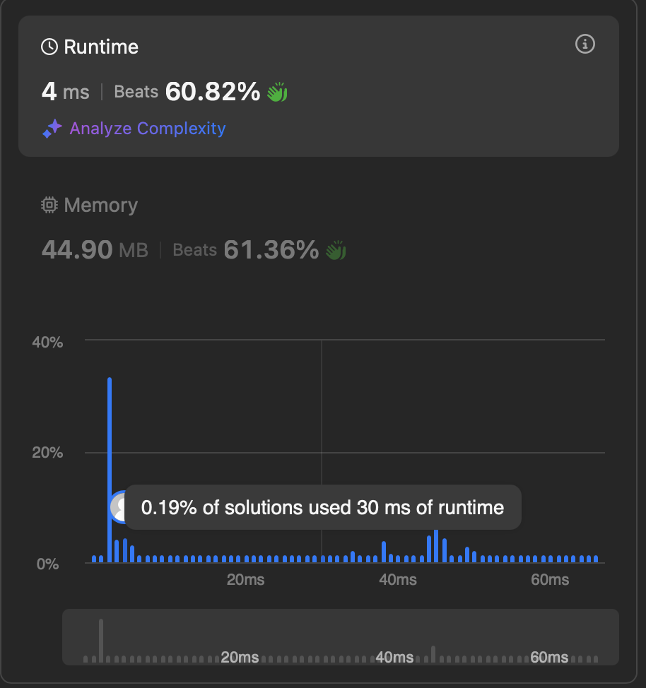

## Question: 1.Two Sum

### Problem Statement
Given an array of integers `nums` and an integer `target`, return indices of the two numbers such that they add up to `target`.

You may assume that each input would have exactly one solution, and you may not use the same element twice.

You can return the answer in any order.

### Example 1:
**Input:** `nums = [2,7,11,15], target = 9`  
**Output:** `[0,1]`  
**Explanation:** Because `nums[0] + nums[1] == 9`, we return `[0, 1]`.

### Example 2:
**Input:** `nums = [3,2,4], target = 6`  
**Output:** `[1,2]`

### Example 3:
**Input:** `nums = [3,3], target = 6`  
**Output:** `[0,1]`

### Constraints:
- `2 <= nums.length <= 10^4`
- `-10^9 <= nums[i] <= 10^9`
- `-10^9 <= target <= 10^9`
- Only one valid answer exists.

### Follow-up:
Can you come up with an algorithm that is less than `O(n^2)` time complexity?

---

## Solution Approach
### Idea:
1. The initial idea is to use nested loops, leading to `O(n^2)` time complexity.
2. More optimal solution is to use a HashMap to store the indices of the numbers seen so far.
3. We iterate through `nums`, checking if `target - nums[i]` is already in the HashMap.
4. If found, we return the indices. Otherwise, we store `nums[i]` with its index.

### Implementation:
```java
import java.util.*;

class Solution {
    public int[] twoSum(int[] nums, int target) {
       HashMap<Integer,Integer> map = new HashMap<>();
       
       for(int i = 0; i < nums.length; i++){
           int difference = target - nums[i];
           if(map.containsKey(difference)){
               return new int[] {map.get(difference), i};
           }
           map.put(nums[i], i);
       }
       
       return new int[] { , };
    }
}
```
### Performance Visualization

Below is a screenshot that demonstrates the runtime performance of the solution:


### Complexity Analysis:
- **Time Complexity:** `O(n)` because we only iterate once.
- **Space Complexity:** `O(n)`
